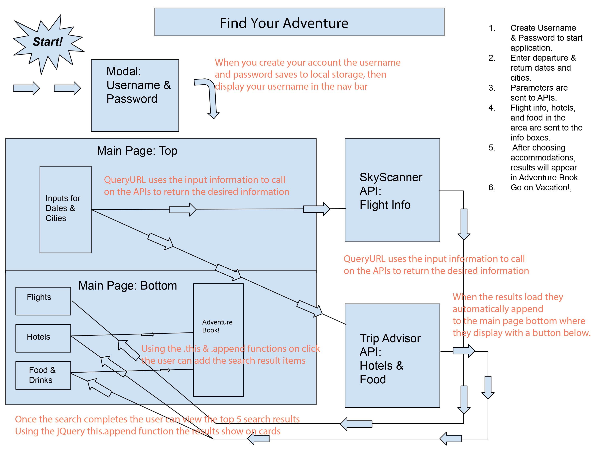
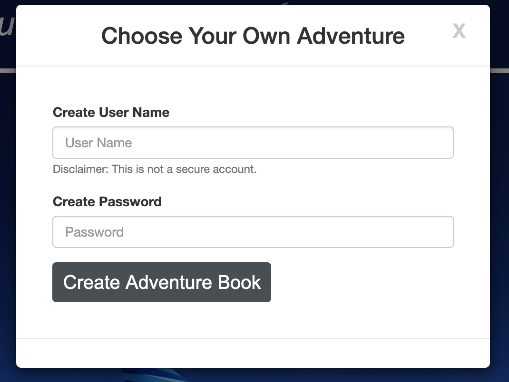
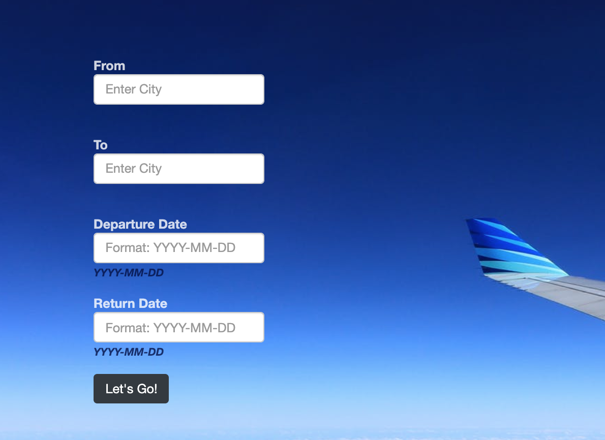
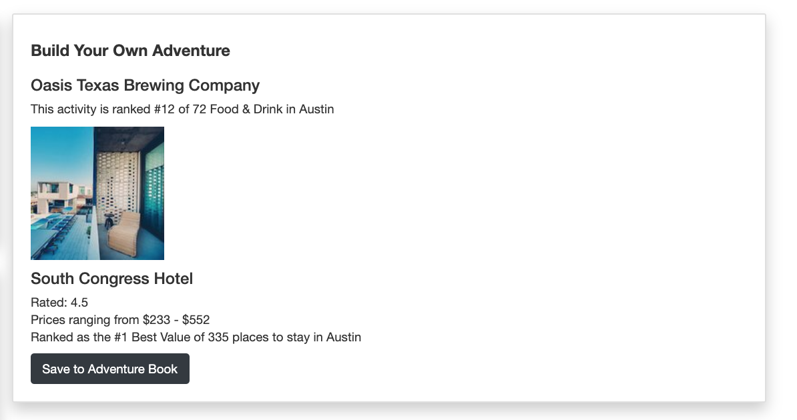
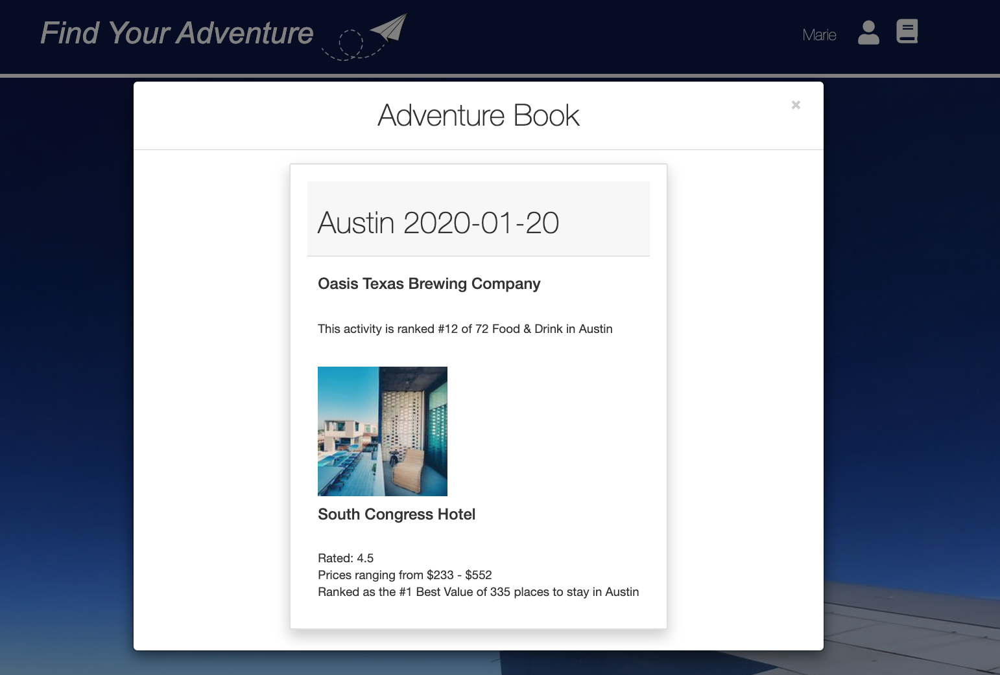

# Choose Your Own Adventure [Send It](https://kaitlyncarlson.github.io/Project-One/)

An application in which users can enter travel parameters that specify the adventure they would like to receive information on, and returns information on flights, hotels, and activities that meet those parameters.

## Purpose / User Story

As a user who wants to travel, I want to minimize planning so that I can adventure more easily.

# Functionality

On load, this application prompts users to create an account. This is not secure, and merely an accent to the application to create a more complete feel for the experience. Upon entering the site, the user may enter their adventure criteria. When the user enters their adventure criteria, and clicks the "Let's Go" button three actions are performed.

Three query calls are created for two apis, Skyscanner and TripAdvisor. Each of these query calls is built using the user's entered adventure criteria. The query call then returns data that matches the user's entered parameters. This data is then rendered into the approprate card (flights, hotels, activities). Each item is rendering with a button called "Mark Your Spot."

The "mark your spot" button enables users to build their custom adventure in the right hand card. Once they have completed their customized adventures, users are able to save the adventure. When saved, their adventures can be viewed in the adventure book modal.

### Content Flow

### Backend Functionality

## User Interface

On Load you are prompted to create a Username and Password

Once you create you username and password you can see if you are logged in if you see your name in the top right corner

After you login start your search using the search fields on the left

This will return results and they will show in the cards below on the left, allowing you to add them to a list in your adventure book on the right.

Once you created your list you can save everything to your adventure book under your account to view later

## APIs

- Skyscanner
- TripAdvisor

## Styles

- CSS Bootstrap
- Font Awesome

## Project GitHub Participants

Remy Guts @remyguts
Kaitlyn Carlson @KaitlynCarlson
Marie Lenac @malicemarie
